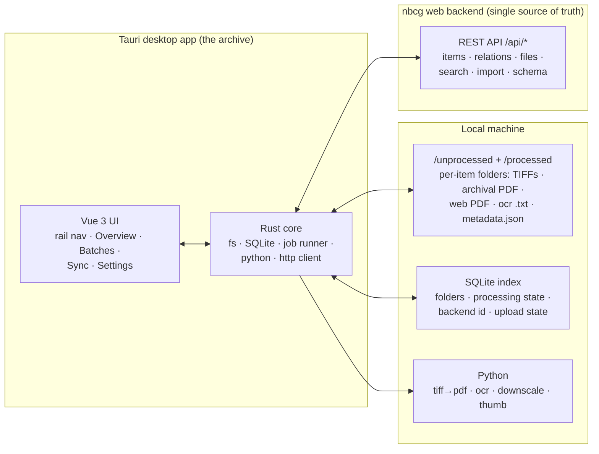

# NBCG-DC — Architecture

> Status: planning (grounded against the real `nbcg` backend, 2026-07-20)
> Last updated: 2026-07-20

## The connection model (the core decision)

**There is one source of truth: the `nbcg` web backend (Postgres).** The
archive is **not** a second system that owns data — it is a **thick desktop
client** of the same REST API the Quasar web frontend uses.

The archive keeps a **local copy** of metadata (in SQLite + a per-folder
`metadata.json`) purely as **downstream storage** — a self-contained,
offline-readable mirror. Rules:

- **We never read authoritative data _from_ the archive** *for items that exist
  on the backend*. The backend is the truth; the local copy is a cache/backup.
  **Before an item's first upload it has no backend record**, so its local
  `metadata.json` / SQLite entry *is* the working source of truth until then.
- **Writes go to the backend first, then we rewrite the local copy** (write-
  through). Create a record → get its id → save `metadata.json`. Edit → `PATCH`
  the backend → rewrite `metadata.json`.
- **Links are by immutable `id`, never by name.** So renaming a collection on
  the web (`abc` → `abd`) changes nothing structurally in the archive; the
  archive shows the current title next time it reads. A rename is a non-event.
- **Sync is one-way: backend → archive** (a manual "refresh my local metadata"
  action). It refreshes copies for records the archive **already tracks**; it
  does not fabricate folders for web-only records. See
  [decisions](03-open-questions.md).

Why this is right (and grounded in the backend): there is **no separate
`Collection` entity** — a "collection" is just a record/draft that has children
via the `item_relations` graph, referenced by id. Two clients editing the same
backend is ordinary multi-client concurrency, not cross-system sync.

## Component overview



## Local storage

### SQLite index (the tracker)

One local database is the archive's index of work. Per item folder it tracks:
its path, the **connected backend id** (once uploaded), processing state
(`pdf`, `thumbnail`, `ocr`, `metadata`, `upload` — pending/running/done/failed),
upload state, and timestamps. This drives the Overview state derivation and
per-stage indicators. It also stores **batches** — the operator's local working
sets (membership, stage, publish/visibility, per-item run outcome) — since
batches are client-side working state and are never sent to the backend (see
[decisions](03-open-questions.md)). It is a **local index only** — never
authoritative catalog data.

### Per-item folder (self-contained)

Each record/item lives in its **own folder** (one folder = one record — see
[decisions](03-open-questions.md); since 2026-08-27 this holds at **any**
depth under the root, not just the top level — see
[nested-record-folders-and-manual-selection](tasks/nested-record-folders-and-manual-selection.md))
under **`/unprocessed`** while it needs work,
then **moved to `/processed`** once processed + described + uploaded. Contents:

- `*.tif` — the source scans.
- the **archival PDF** (built from TIFFs) — kept local, full quality.
- the **web PDF** (downscaled) — this is what gets **uploaded**.
- the **OCR text** (`.txt`) — produced locally (PaddleOCR).
- `metadata.json` — a mirror of the backend record's metadata (written on
  create/update/sync), so each folder is self-describing.

> If the SQLite index is ever lost, folders should carry enough (the backend id
> in `metadata.json` + presence of derived files) to rebuild the index.

## Processing pipeline (runs locally, in the archive)

Deterministic steps; **OCR is done on the archive, not the backend**:

```
TIFFs ──tiff2pdf──▶ archival PDF ──downscale──▶ web PDF  (uploaded)
                         │
                         └──ocr──▶ full text (.txt)  (uploaded alongside web PDF)
```

- If TIFFs exist → always build the archival PDF.
- If a PDF exists → always run OCR (local).
- Always build the downscaled **web PDF** — the copy actually uploaded.
- Prototypes: [`py/web.py`](../py) (PDF/thumb/downscale),
  [`py/ocr.py`](../py) (PaddleOCR). Note `ocr.py` uses the Linux-only
  `resource.setrlimit` — must be made cross-platform (target is Windows).

Surfaced through the batch UI, this is the five-stage pipeline the operator
sees — **PDF** (archival + web), **Thumbnail**, **OCR**, **Metadata** (validates
required fields), **Uploaded** — with `pending → running → done | failed` (+
`queued`). Only **one batch runs at a time, per workstation** (app-enforced; the
deployment is a single machine, so no backend lock). Derived files are named
after the item's **folder** (`<name>.pdf`, `<name>_archive.pdf`,
`<name>_thumb.png`, `<name>.txt`, `<name>.json`); the archival master + TIFFs
stay local. See [processing](tasks/06-processing-pipeline-and-jobs.md).

## Backend API surface (what exists + what we're adding)

The archive talks only to `/api/*`. **Existing** endpoints:

| Purpose | Endpoint |
|---|---|
| Create record/draft | `POST /api/items` (`targetState: DRAFT\|RECORD`, `visibilityStatus: PUBLIC\|PRIVATE\|HIDDEN`) |
| Update (partial, metadata shallow-merged) | `PATCH /api/items/:id` |
| Publish / move draft↔record | `POST /api/items/transition` |
| Delete (bulk) | `DELETE /api/items` |
| Link / unlink parents | `POST /api/relations/connect` · `/disconnect` |
| Upload files | `POST /api/files/upload/:itemId` (multipart; `doOCR` flag; `extractedTexts` JSON map filename→text) |
| List / download / re-extract / set-text / delete files | `GET /api/files/:itemId` · `GET /api/files/:fileId/download` · `POST /api/files/:fileId/extract` · `PUT /api/files/:fileId/text` · `DELETE /api/files/:fileId` |
| COBISS import (async, **creates** item — *not used by the archive create flow; it previews then `POST /api/items`, to avoid orphan drafts*) | `POST /api/import/cobiss` · `GET /api/import/jobs/:jobId` |
| Search / read-by-id / children | `GET /api/search` · `GET /api/search/:id` · `GET /api/search/:id/children` |

| Field schema | `GET /api/schema/record?level=main\|child` (strong ETag; `parentInheritable` / `issueIdentifying` flags per field) |
| COBISS preview (sync, no persist) | `GET /api/import/cobiss/preview/:cobissId` |
| Replace one attachment (stable id) | `PUT /api/files/:fileId` |
| Visibility counts (only scoped GET) | `GET /api/items/stats` |
| Reachability | `GET /api/health` |

**Everything the archive needs already exists** (confirmed 2026-08-07, Epic 09).
The list once filed as "new backend work we requested" has been overtaken:
the **schema** endpoint ships with the `parentInheritable` / `issueIdentifying`
flags and a `levels` array; **COBISS preview** is live at
`GET /api/import/cobiss/preview/:cobissId` (**not** `/api/cobiss/:id/preview` —
the old path in these docs was wrong); **external full-text ingest**
(`extractedTexts` map on upload) and **attachment roles** are implemented;
**replace-file** exists as `PUT /api/files/:fileId`; and **optimistic
concurrency** shipped as a required `expectedVersion` body field (→ `409`),
not as an `If-Match` header. The only outstanding item is **item_relations
integrity** (an internal cleanup of dangling relations/counts on delete — no
endpoint). The P3 filed by Epic 09 — relation writes bumping the parent's
`version` without reporting it — was **fixed backend-side on 2026-08-07**:
`connect`/`disconnect` now return the parent's post-write state (see
[Epic 09 → Backend gaps](tasks/09-backend-api-contract.md)).

**Already present, just wire it:** the backend models **visibility** as
`VisibilityStatus { PUBLIC, PRIVATE, HIDDEN }` on both `Draft` and `Record`
(required in `CreateItemDto`), so the batch's Public/Private/Hidden choice maps
straight to `visibilityStatus` — no backend change needed.

### Two consistency caveats the archive must respect

1. **Read-after-write lag.** `GET /api/search/:id` reads OpenSearch, which is
   fed asynchronously by the pgsync CDC daemon. After a write, **trust the
   POST/PATCH response** and update the local mirror from it; for later re-reads
   use `GET /api/search/:id` and expect CDC lag — show local immediately and
   refresh in the background (see
   [maybe: read-after-write refresh](tasks/maybe-read-after-write-refresh.md)).
   We are **not** adding a direct Postgres read-by-id.
2. **Concurrency.** `PATCH /api/items/:id` requires `expectedVersion` and `409`s
   on a mismatch — not last-write-wins, and not an `If-Match` header. Metadata
   shallow-merges only the keys sent, so send **only changed fields**. Note that
   `POST /api/relations/connect` and `POST /api/items/transition` both bump
   `version` **without returning it**, so a cached version can go stale without
   the archive touching the item (Epic 09).

## Auth

**For now: a static API token issued from Keycloak**, stored in app config and
sent as the `Authorization: Bearer` header on every request. It just needs the
right `nbcg-api` roles. Per-librarian interactive login (for attribution) can
replace it later; the `nbcg-worker` service-account also exists for unattended
use. See [decisions](03-open-questions.md).

## Frontend state & offline

- **State:** Pinia store mirroring the selected item (from SQLite + backend
  reads) and the cached schema.
- **Offline:** local file processing works fully offline. COBISS preview,
  parent search, sync, and upload require the backend; uploads **queue** and
  flush on reconnect — a queue of intents through the same create/update API,
  **not** a two-way sync.

## Data flow — the happy path (COBISS main record)

```mermaid
sequenceDiagram
    participant U as User
    participant App as Archive (Vue+Rust)
    participant API as nbcg backend
    U->>App: Select /unprocessed folder, enter COBISS id, "Get data"
    App->>API: GET /api/import/cobiss/preview/:cobissId   (no persist)
    API-->>App: normalized metadata → prefill form
    U->>App: Run pipeline (tiff→pdf, ocr, downscale)
    App->>App: build web PDF + ocr .txt; update SQLite
    U->>App: Upload
    App->>API: POST /api/items {targetState}
    API-->>App: record id
    App->>API: POST /api/files/upload/:id (web PDF + thumbnail; extractedTexts map; doOCR=false)
    App->>API: POST /api/relations/connect (parents)
    App->>App: write metadata.json (id + metadata), mark uploaded in SQLite
```
